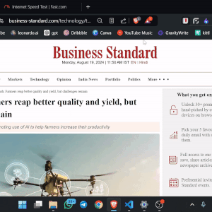

# 📚 Dictionary-Thesaurus Chrome Extension

A lightweight Chrome extension that enables users to quickly find the meaning, pronunciation, and synonyms of any word without leaving the current webpage. Just select a word, right-click, and choose "Find Meaning" to instantly see a popup with the word's definition, pronunciation, and available synonyms. Alternatively, you can search for a word by clicking the extension's action icon.

## ✨ Features

- ⚡ **Instant Word Lookup**: Right-click on any selected word to quickly find its meaning, pronunciation, and synonyms in a popup.
- 🔍 **Action Icon Search**: Click the extension's action icon to manually search for the meaning, pronunciation, and synonyms of any word.
- 🔊 **Pronunciation**: Hear the correct pronunciation of words when available.
- 📝 **Synonyms**: Discover synonyms for the selected word to expand your vocabulary.

## 🎥 Demo

<table>
<tr>
<td>


**Right-Click Word Lookup**
1. Select a word  
2. Right-click on it  
3. Click find meaning  

</td>
<td>



**Action Icon Search**
1. Click on the action icon from the extensions  
2. Type the word  
3. Search  

</td>
</tr>
</table>

<!-- 
<div style="display: flex; gap: 20px;">

<div>


**Right-Click Word Lookup**  
1️⃣ Select a word  
2️⃣ Right-click on it  
3️⃣ Click "Find Meaning"
</div>

<div>


**Action Icon Search**  
1️⃣ Click on the action icon from the extensions  
2️⃣ Type the word  
3️⃣ Search  
</div>

</div> -->

## 🛠 Installation

1. **Download the extension**:
    - Clone the repository to your local machine:
        ```bash
        git clone https://github.com/ujjwalrajput-git/Dictionary-Thesaurus.git
        ```
    - Alternatively, download the repository as a ZIP file and extract it.

2. **Load the extension in Chrome**:
    - Open `chrome://extensions/` in your Chrome browser.
    - Enable "Developer mode" using the toggle in the top right corner.
    - Click "Load unpacked" and select the directory where you cloned or extracted the extension.

3. **You're all set!** 🎉 The extension should now appear in your Chrome toolbar.

## 🚀 Usage

### Word Lookup

- **🔍 Right-click Search**:
    1. Highlight any word on a webpage.
    2. Right-click and select the "Find Meaning" option.
    3. A popup will appear with the word's definition, pronunciation, and synonyms.

- **🔎 Action Icon Search**:
    1. Click on the extension's icon in the Chrome toolbar.
    2. Enter a word in the search bar.
    3. View the word's meaning, pronunciation, and synonyms in the popup.

## 🤝 Contributing

Contributions are welcome! 🎉 To contribute:

1. Fork the repository.
2. Create a new branch (`git checkout -b feature/YourFeature`).
3. Make your changes.
4. Commit your changes (`git commit -m 'Add some feature'`).
5. Push to the branch (`git push origin feature/YourFeature`).
6. Open a pull request.

Please ensure that your code follows the project's coding standards and includes appropriate tests.

## 📄 License

This project is licensed under the MIT License - see the [LICENSE](LICENSE) file for details.

## 🔮 Future Plans

- 🌍 **Extended Language Support**: Add support for multiple languages.
- ❗ **Antonym Feature**: Include antonyms in the popup alongside definitions and synonyms.
- 🛠 **Customization Options**: Allow users to customize the appearance and behavior of the popup.

## 💬 Acknowledgements

- Thanks to [API Provider] for the dictionary, pronunciation, and thesaurus services.
- Inspired by the need for quick and easy word lookups without disrupting the browsing experience.
